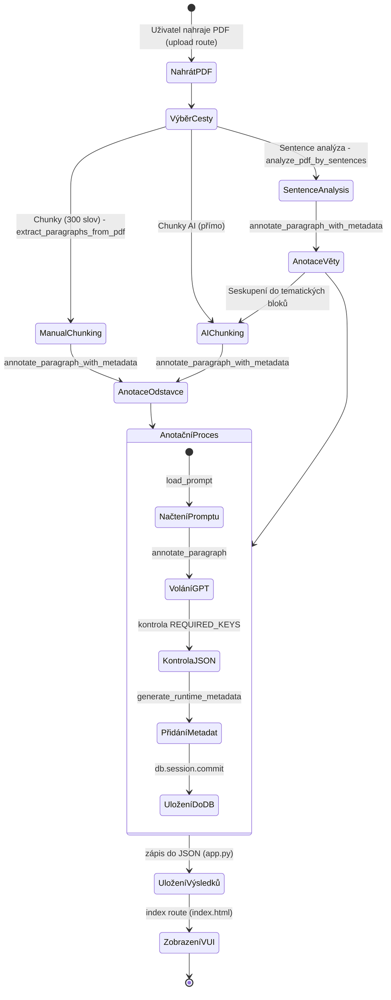

```mermaid
stateDiagram-v2
    [*] --> NahrátPDF : Uživatel nahraje PDF (upload route)
    
    NahrátPDF --> VýběrCesty
    
    state VýběrCesty <<choice>>
    VýběrCesty --> ManualChunking : Chunky (300 slov) - extract_paragraphs_from_pdf
    VýběrCesty --> SentenceAnalysis : Sentence analýza - analyze_pdf_by_sentences
    VýběrCesty --> AIChunking : Chunky AI (přímo)

    ManualChunking --> AnotaceOdstavce : annotate_paragraph_with_metadata
    AIChunking --> AnotaceOdstavce : annotate_paragraph_with_metadata

    SentenceAnalysis --> AnotaceVěty : annotate_paragraph_with_metadata
    AnotaceVěty --> AIChunking : Seskupení do tematických bloků

    state AnotačníProces {
        [*] --> NačteníPromptu : load_prompt
        NačteníPromptu --> VoláníGPT : annotate_paragraph
        VoláníGPT --> KontrolaJSON : kontrola REQUIRED_KEYS
        KontrolaJSON --> PřidáníMetadat : generate_runtime_metadata
        PřidáníMetadat --> UloženíDoDB : db.session.commit
    }

    AnotaceOdstavce --> AnotačníProces
    AnotaceVěty --> AnotačníProces

    AnotačníProces --> UloženíVýsledků : zápis do JSON (app.py)
    
    UloženíVýsledků --> ZobrazeníVUI : index route (index.html)
    ZobrazeníVUI --> [*]
```